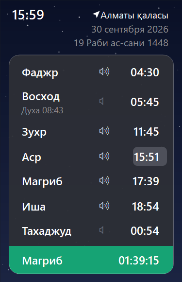
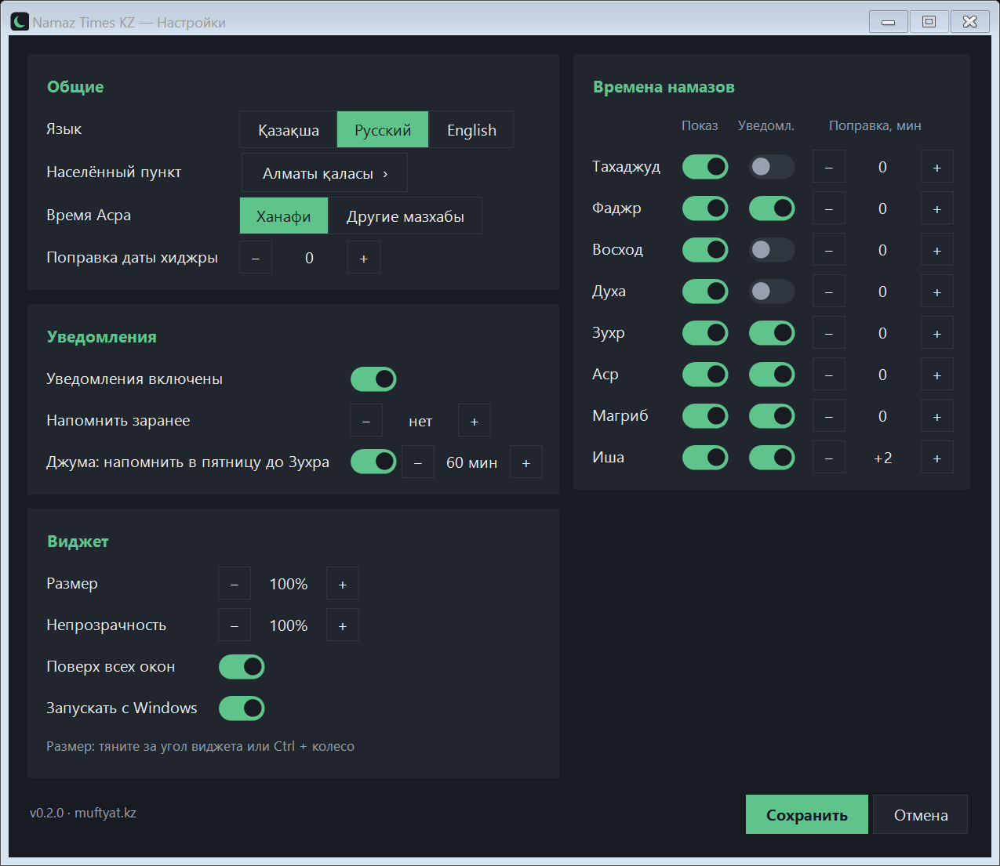

# Namaz Times KZ

Windows-қа арналған намаз уақыттары: жұмыс үстеліндегі виджет және хабарламалар.
Уақыттар Қазақстан мұсылмандары діни басқармасының ([muftyat.kz](https://muftyat.kz)) ресми деректері бойынша алынады.

Интерфейс тілдері: қазақша · орысша · ағылшынша.

> **English:** Namaz Times KZ is a free, open-source prayer times app for Windows 10/11. It shows official prayer times
> of the Spiritual Administration of Muslims of Kazakhstan (muftyat.kz) for any of 5,700+ places in Kazakhstan in a desktop widget,
> with notifications, a monthly timetable, Islamic holidays, Ramadan suhoor/iftar countdown, a dhikr counter and the 99 Names of Allah.

 

## Жүктеп алу

[Releases](../../releases/latest) бетінен:

- **`NamazTimes-x.y.z.msi`** — орнатқыш («Бастау» мәзіріне белгіше қосады, «Қолданбалар» арқылы жойылады);
- **`NamazTimes.exe`** — орнатусыз іске қосылатын бір файл.

Қосымша ештеңе (.NET т.б.) орнатудың қажеті жоқ.

> Файлдарға цифрлық қолтаңба қойылмаған, сондықтан алғаш іске қосқанда Windows SmartScreen ескерту көрсетуі мүмкін:
> «Толығырақ» → «Бәрібір іске қосу» басыңыз.

### Жою / Uninstall

- **MSI**: «Параметрлер» → «Қолданбалар» → «Namaz Times KZ» → «Жою». / *Settings → Apps → Namaz Times KZ → Uninstall.*
- **NamazTimes.exe**: мәзірден «Шығу», содан кейін файлды және `%AppData%\NamazTimes` қалтасын жойыңыз;
  «Windows-пен бірге іске қосу» қосулы болса, алдымен баптаулардан өшіріңіз.
  / *Exit from the menu, turn off "Start with Windows" in settings, then delete the file and the `%AppData%\NamazTimes` folder.*

## Мүмкіндіктер

- **Виджет**: сағат, григориан және хижра күнтізбесі бойынша күн, келесі намазға дейінгі кері санақ, бүгінгі мереке.
  Тінтуірмен кез келген жерге жылжытылады; өлшемі — оң жақ төменгі бұрышынан тарту немесе Ctrl + дөңгелек.
  Жоғарғы сол жақта ⚙ (баптаулар) және ⋯ (мәзір: айлық кесте, мерекелер, зікір, 99 есім, намаз түрлері, қаза намаздар т.б.) белгішелері бар.
  Тінтуірді апарғанда «Жию», «Толық экран», «Жабу» батырмалары шығады.
- **Уақыттар**: Таң, Күн (Духа), Бесін, Екінті, Ақшам, Құптан, Таһажуд — әрқайсысын жасыруға болады.
- **Хабарламалар**: намаз уақыты кіргенде және алдын ала (N минут бұрын). Виджеттегі 🔈 белгісін бір рет басу арқылы қосылады/өшіріледі.
  Жұма күні бесін алдында еске салу.
- **Екінті уақыты**: Ханафи (ДҰМ сияқты) немесе басқа мазхабтар.
- **Қолмен түзету**: әр уақытты ± минутқа жылжыту.
- **Айлық кесте**: айлар бойынша парақтау.
- **Ислам мерекелері**: бір жыл алға.
- **Зікір (тәспі)**: 19 зікір (субханаллаһ, истиғфар, салауат, лә иләһә иллаллаһ, лә хәулә, Юнус дұғасы, таңғы-кешкі зікірлер т.б.) — арабша мәтіні, оқылуы, мағынасы, фазилеті мен дереккөзі; шерту немесе Бос орын пернесімен санау, ұсынылған / 33 / 99 / 100 / ∞ мақсат, бүгінгі қорытынды.
- **Алланың 99 есімі**: виджетте күн сайын жаңа «Есім күні», барлық 99 есімнің терезесі (арабша, оқылуы, мағынасы, іздеу).
- **Намаз түрлері**: 18 қосымша және ерекше намаз (таһажуд, үтір, ишрақ, духа, әууәбин, сүннеттер, тарауих, истихара, хажат, тәубе, шүкір, сапар, айт, жаназа т.б.) — үкімі, уақыты, ракағат саны, қалай оқылады, дәлел ретінде аят пен хадис.
- **Қаза намаздар**: Таң, Бесін, Екінті, Ақшам, Құптан және Үтір бойынша есептегіш — «+» өткізілгенін қосады, «Өтедім» азайтады; күн/ай/жыл бойынша бірден қосуға болады. Ораза қазасы бөлек саналады.
- **Рамазан**: Таң жолында «Сәресі», Ақшам жолында «Ауызашар» белгісі және ауызашарға / сәресі біткенге дейінгі кері санақ (Рамазан айында өзі қосылады).
- **5700-ден астам елді мекен**: тізім бағдарламаның ішінде, интернетсіз жұмыс істейді.
- Кесте жылына бір рет жүктеледі, содан кейін интернетсіз жұмыс істейді (`%AppData%\NamazTimes`).
- **Жаңарту**: жаңа нұсқа шыққанда виджетте «Жаңа нұсқа — жаңарту» белгісі шығады; басқанда бағдарлама өзі жүктеп, орнатып, қайта іске қосылады.

### Қосымша уақыттар қалай есептеледі

- **Таһажуд** — түннің соңғы үштен бірінің басы (Ақшамнан Таңға дейін).
- **Духа** — күн шыққаннан кейін жарық күннің төрттен бірі: күн шығуы + (күн батуы − күн шығуы) / 4.
- **Басқа мазхабтар бойынша Екінті** — ДҰМ уақытынан 2× және 1× көлеңке арасындағы астрономиялық айырма алынады.
- **Хижра** — Умм әл-Құра күнтізбесі; ДҰМ хабарландыруына сай баптауларда ±2 күн түзету бар.

## Құрастыру

```
dotnet build -c Release
```

Орнатқыш (WiX 5): `dotnet build installer -p:ProductVersion=0.2.0 -p:ExePath=..\out\NamazTimes.exe`

Жаңа нұсқа шығару: `git tag v0.3.0 && git push origin v0.3.0` — GitHub Actions exe мен MSI құрастырып, релиз жариялайды.

Елді мекендер тізімін жаңарту: `node tools/cities.mjs`.

99 есімнің мәтіндері (оқылуы мен мағынасы) — [names99.json](names99.json). Намаз түрлері — [prayers.json](prayers.json). Зікірлер — [dhikr.json](dhikr.json). Түзетулерді қош көреміз.

## Code signing policy

Free code signing provided by [SignPath.io](https://about.signpath.io/), certificate by [SignPath Foundation](https://signpath.org/).
*(Application pending — releases up to v0.4.0 are not signed yet.)*

- Committers and reviewers: [@nurekella](https://github.com/nurekella)
- Approvers: [@nurekella](https://github.com/nurekella)

Only binaries built by GitHub Actions from this repository ([release workflow](.github/workflows/release.yml)) are signed.
Every release is approved manually before signing.

## Privacy policy

This program will not transfer any information to other networked systems unless specifically requested by the user
or the person installing or operating it. The only network requests it makes are:

- `api.muftyat.kz` — downloads the yearly prayer timetable for the location **you choose** (its coordinates are part of the request);
- `api.github.com` / `github.com` — checks this repository's Releases for a newer version once a day and, only when you click
  "update", downloads it.

No personal data, usage statistics or identifiers are collected or sent. Settings and the cached timetable are stored locally
in `%AppData%\NamazTimes`.

Бағдарлама ешқандай жеке дерек жинамайды және жібермейді. Желіге тек екі жерге жүгінеді: таңдалған елді мекеннің кестесі үшін
`api.muftyat.kz` және жаңа нұсқаны тексеру/жүктеу үшін GitHub.

## Лицензия

Бағдарлама коды — [MIT](LICENSE).

Намаз уақыттары мен елді мекендер тізімі — Қазақстан мұсылмандары діни басқармасының ([muftyat.kz](https://muftyat.kz)) деректері; олар MIT лицензиясына кірмейді және ДҰМ-ға тиесілі. Бұл жоба ДҰМ-ның ресми қолданбасы емес.
